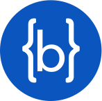

</img>

<h2> Olá, meu nome é Bruno Costa C. 😁</h2> 
<li>🛠 Dev. Web Junior e Designer</li>   

  

      
  
Sou um desenvolvedor Full-Stack Jr e Designer Gráfico.  
    
  Eu tenho conhecimento em programação web, de games e de bem básica em aplicativos, também possuo habilidades em animação com Cinema 4D e 3ds Max, edição de vídeo, desenhos, web design e design gráfico. O que me permite ter uma visão mais ampla e criativa.    
  
  Como profissional, sou bastante esforçado e dedicado, sempre buscando ampliar meus conhecimentos e me manter atualizado com as tendências de mercado. Sou detalhista e criativo, características que me ajudam a desenvolver soluções inovadoras e funcionais.

 
  

  <h2>Tecnologias e linguagens que estou utilizando no momento:</h2>  
  
  

       
  

 
  <h2>Tecnologias e linguagens que já estudei e/ou usei:</h2>   
  
  

    
  

   

 

  <h2>Redes Sociais:</h2>  
      
          
      
    
    

 

  <h2>Status no GitHub:</h2>  

  |  |  |
  | :-: | :-: |

  
      
    
  
    
  
    

